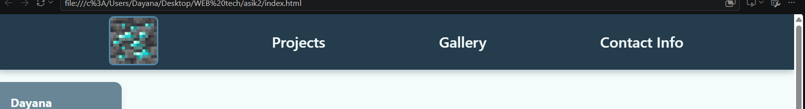
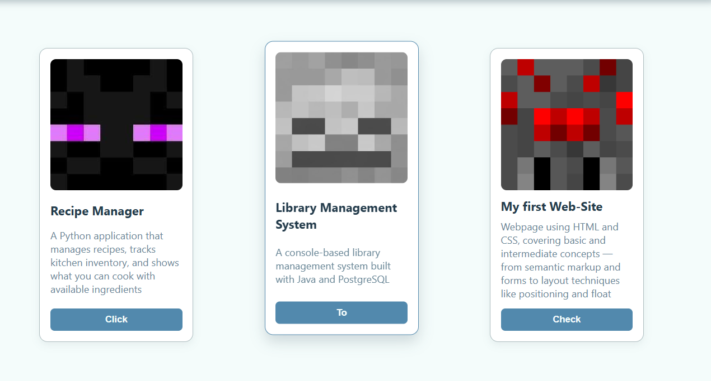
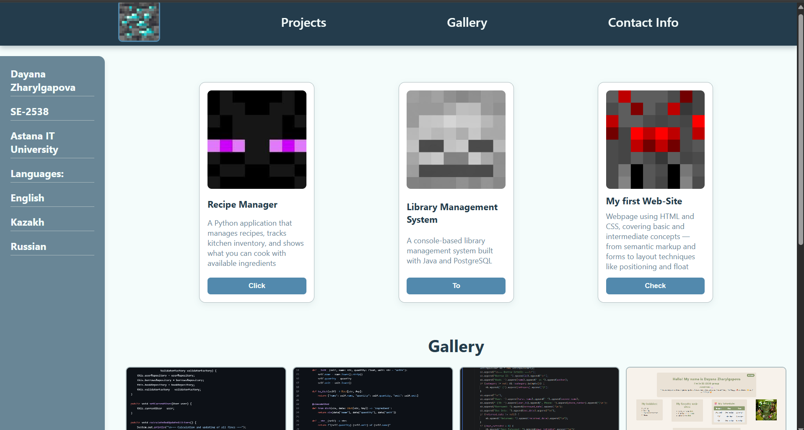
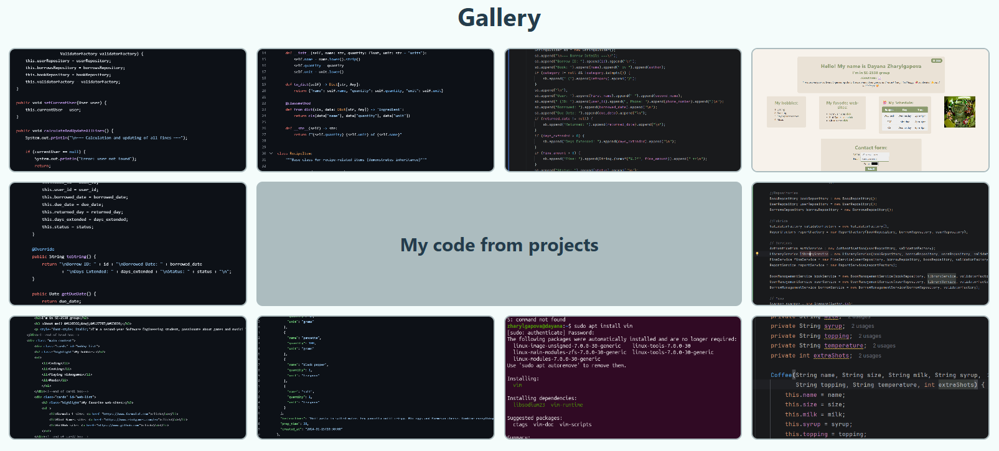
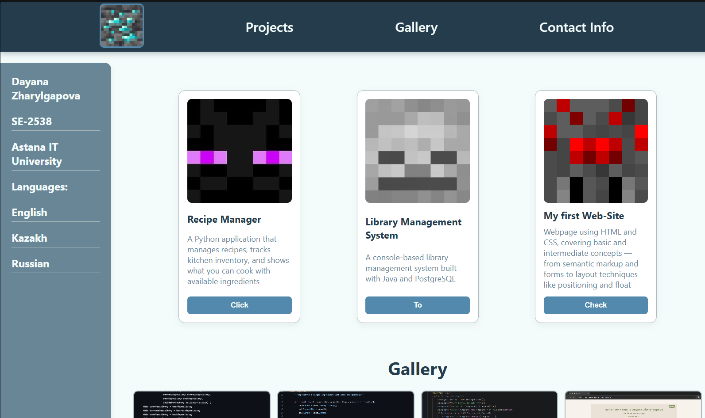
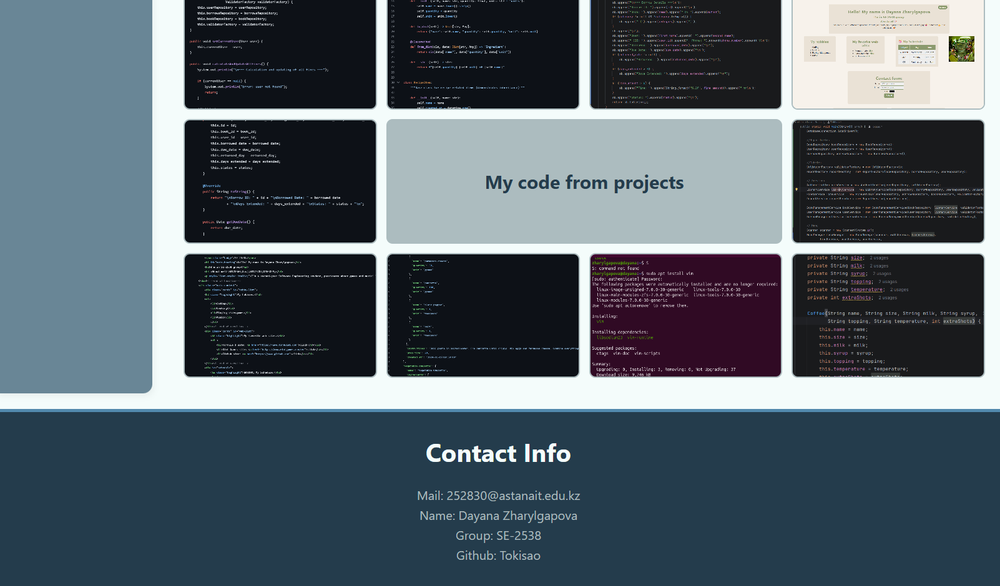

# Assignment #2. Advanced CSS (Flexbox & Grid)

**Name:** Dayana Zharylgapova  
**Group:** SE-2538  
**Course:** Web Technologies / Front-End Development  
**Project:** Personal Portfolio Page  
**Repository:** https://github.com/Tokisao/Assignment2-Portfolio

---

## Project Overview

This project is a personal portfolio page built with HTML5 and CSS3. The main goal of the assignment is to practice advanced CSS layout techniques using **Flexbox** and **CSS Grid**. The page includes a header navigation bar, sidebar, project cards, image gallery, and footer.

The layout combines:
- **Flexbox** for the navigation bar, card containers, and card content alignment.
- **CSS Grid** for the overall page structure and the image gallery.
- Hover effects, equal-height cards, spacing, and caption overlays.

## Project Structure

```text
portfolio/
├── index.html
├── stile.css
├── images/
│   ├── favicon.jpg
│   ├── icon.jpg
│   ├── card1.jpg
│   ├── card2.jpg
│   ├── card3.jpg
│   ├── image1.png
│   ├── photo2.png
│   ├── photo3.png
│   ├── photo4.png
│   ├── photo5.png
│   ├── photo6.png
│   ├── photo7.png
│   ├── photo8.png
│   ├── photo9.png
│   └── photo10.png
└── README.md
```

---

## How to Run

1. Download or clone the repository.
2. Make sure all images are placed inside the `images/` folder.
3. Open `index.html` in any modern web browser.
4. The portfolio page will load without additional setup.

---

## Assignment Tasks

## Part 1. Flexbox

### 1.1 Header Section with Logo and Navigation

**Task:**  
Create a header section with a logo and a list of links. Turn the header container into a flex container, align the logo and links horizontally, add spacing between the links, and vertically center the items.

**Implementation:**  
The header navigation uses `#nav_bar` as a flex container:

```css
#nav_bar {
    display: flex;
    justify-content: space-evenly;
    align-items: center;
    gap: 25px;
    flex-wrap: wrap;
}
```

The logo image `#photo` is sized and styled with a border and border radius. The navigation links use hover color transitions. The `gap` property creates consistent spacing between navigation items, and `align-items: center` vertically centers the logo and links.

**Screenshot:**  


---

### 1.2 Task 1. Card Row

**Task:**  
Create a container with at least three cards. Each card should include an image, title, text, and button. Make the container a flex container, ensure all cards have equal height, add consistent gaps, and add a hover effect.

**Implementation:**  
The card container `#container` uses Flexbox:

```css
#container {
    display: flex;
    justify-content: space-evenly;
    align-items: stretch;
    flex-wrap: wrap;
    gap: 20px;
}
```

Each `.card` uses `display: flex` with `flex-direction: column` and `justify-content: space-between`, so the content is arranged vertically and the button stays aligned at the bottom. Because the container uses `align-items: stretch`, all cards have equal height.

Hover effect:

```css
.card:hover {
    transform: translateY(-10px);
    box-shadow: 0 10px 20px rgba(36, 60, 76, 0.18);
    border-color: #5289AD;
}
```

**Screenshot:**  


---

## Part 2. Grid System

### 2.1 Task 2. Page Layout with Grid Areas

**Task:**  
Set up a layout with a header, sidebar, main content, and footer. Turn the parent container into a grid container, define rows and columns, assign grid areas, and confirm that each section fits correctly.

**Implementation:**  
The main page container `.portfolio-page` uses CSS Grid:

```css
.portfolio-page {
    display: grid;
    grid-template-columns: 200px 1fr;
    grid-template-rows: auto 1fr auto;
    grid-template-areas:
        "header  header"
        "sidebar main"
        "footer  footer";
    gap: 20px;
    min-height: 100vh;
}
```

The header spans the top, the sidebar is placed on the left, the main content is on the right, and the footer spans across the bottom. Each section is assigned with `grid-area`.

**Screenshot:**  


---

### 2.2 Task 3. Image Gallery

**Task:**  
Collect at least nine images and place them inside a gallery container. Set the gallery as a grid container, define multiple equal-width columns and rows, add consistent gaps, and add a hover effect with a caption overlay.

**Implementation:**  
The gallery uses CSS Grid:

```css
#gallery {
    display: grid;
    grid-template-columns: repeat(4, 1fr);
    grid-template-rows: repeat(3, 160px);
    gap: 12px;
    grid-template-areas:
        "top1   top2   top3   top4"
        "left1  text   text   right1"
        "bot1   bot2   bot3   bot4";
}
```

Each gallery item has an image and an overlay caption. The overlay is hidden by default and appears on hover:

```css
.overlay {
    position: absolute;
    top: 0;
    left: 0;
    width: 100%;
    height: 100%;
    background-color: rgba(36, 60, 76, 0.85);
    color: #F4FCFB;
    display: flex;
    justify-content: center;
    align-items: center;
    opacity: 0;
    transition: opacity 0.3s ease;
}

.gallery-item:hover .overlay {
    opacity: 1;
}
```

The gallery contains 10 images, which is more than the required minimum of 9.

**Screenshot:**  


---

## Part 3. Combining Flexbox & Grid

**Task:**  
Create a page structure with header, main section, sidebar, and footer. Use Flexbox in the header for the navigation bar. Use CSS Grid for the main section. Inside each project card, use Flexbox to arrange content. Ensure the footer spans across the bottom.

**Implementation:**  
The overall page uses CSS Grid for the header, sidebar, main content, and footer. The navigation bar uses Flexbox for horizontal alignment and spacing. The project cards are placed inside a Flexbox container, and each card uses Flexbox internally to arrange the title, description, and button.

This combination allows the page to have:
- A structured grid layout.
- Flexible navigation and card alignment.
- Equal-height cards with consistent spacing.
- A footer that spans across the bottom.

**Screenshot:**  



---

## Summary of Work Process

I started by creating the HTML structure of the portfolio page, including the header, sidebar, main content area, project cards, image gallery, and footer. After that, I applied a CSS reset to remove default browser spacing and make the layout more predictable.

Next, I built the main page layout using CSS Grid with `grid-template-areas`. This made it easy to place the header, sidebar, main content, and footer correctly. Then I used Flexbox for the navigation bar and the project card container. Flexbox helped align the navigation items, add spacing with `gap`, and make all cards equal in height.

For the project cards, I used `display: flex` and `justify-content: space-between` so that the button stayed at the bottom of each card. I also added hover effects using `transform`, `box-shadow`, and `transition`.

For the gallery, I used CSS Grid to create a 4-column, 3-row layout. Each gallery item contains an image and an overlay caption. The overlay is hidden by default and appears on hover using `opacity`.

The main challenge was combining both Flexbox and Grid without making the layout messy. I solved this by using Grid for large page sections and Flexbox for smaller internal components. This made the layout cleaner and easier to maintain.

Overall, this assignment helped me understand when to use Flexbox and when to use CSS Grid. I also learned how to control alignment, spacing, equal heights, and hover effects using modern CSS layout techniques.

---

## Conclusion

This project successfully demonstrates the use of advanced CSS layout techniques. Flexbox is used for one-dimensional layouts such as the navigation bar and card content, while CSS Grid is used for two-dimensional layouts such as the overall page structure and image gallery. The final portfolio page is organized, visually consistent, and follows the requirements of Assignment #2.
